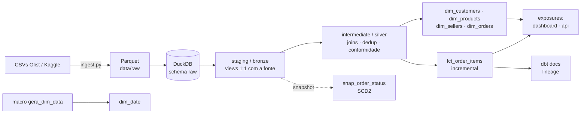

# POC 1 — dbt + lakehouse medallion — Arquitetura e decisões

> ⚠️ GABARITO. Não leia antes de fazer o seu próprio desenho a partir de
> `docs/desafio.md`. Depois compare; o que sobreviver da sua versão vira
> `docs/arquitetura.md` + a base do `README.md`.

## 1. O que a POC prova

dbt de ponta a ponta sobre um dataset relacional real:

- modelagem em camadas (medallion: bronze → silver → gold);
- modelagem dimensional (star schema) nos marts;
- testes de qualidade versionados junto do código;
- macros reutilizáveis, snapshot SCD2, modelo incremental;
- lineage + docs geradas;
- `dbt build` no CI barrando regressão em cada PR.

Cobre requisito central do iFood e desejável de Ibope/Kantar e Jump.

## 2. Dataset — Olist Brazilian E-Commerce (Kaggle)

~100k pedidos, 9 tabelas relacionais:

| tabela | grão | papel |
|---|---|---|
| `orders` | 1 pedido | fato-cabeçalho / origem de datas e status |
| `order_items` | 1 item de pedido | **grão do fato gold** |
| `order_payments` | 1 transação de pagamento | agregável por pedido |
| `order_reviews` | 1 review | nota/comentário por pedido |
| `customers` | 1 cliente (por pedido) | dimensão |
| `products` | 1 produto | dimensão |
| `sellers` | 1 vendedor | dimensão |
| `geolocation` | 1 CEP-prefixo | enriquecimento geográfico |
| `product_category_name_translation` | 1 categoria | conformidade (pt→en) |

Por que Olist: dá modelagem dimensional de verdade (não é um CSV chapado),
é público, é brasileiro, e é o mesmo dataset das POCs 1–4 (mostra evolução).

## 3. Camadas

### 3.1 Ingestão / raw (fora do dbt)

`ingest/ingest.py`:

1. baixa os CSVs do Olist;
2. escreve cada um como Parquet em `data/raw/` (gitignored);
3. carrega em `raw.<tabela>` no DuckDB com `CREATE OR REPLACE TABLE` (idempotente).

- **Por que Parquet no meio, e não CSV direto no dbt:** espelha o padrão
  lakehouse real — landing zone de arquivos colunares no object store. Formato
  colunar, tipado, comprimido. Torna a ingestão idempotente e reprodutível.
- **Por que fora do dbt:** dbt é transformação (T), não extração. `ingest.py`
  é o "EL" do ELT. Na POC 3 esse passo vira uma task do Airflow.

### 3.2 Staging / bronze — `models/staging/` (materialização `view`)

Um modelo `stg_*` por fonte, **1:1 com a origem**:

- renomeia colunas para um padrão único (snake_case, nomes em pt ou en — **escolher um**);
- `cast` de tipos, `trim`, parse de timestamps;
- centavos → reais via macro `centavos_para_reais()`;
- **nenhum join, nenhuma regra de negócio.**

`models/staging/_sources.yml`: define a source `olist`, com `loaded_at_field`
e blocos `freshness` (warn / error).

Regra que guia a camada: *se a fonte mudar, só o staging muda.*

### 3.3 Intermediate / silver — `models/intermediate/`

Onde mora a lógica de negócio intermediária:

- `int_order_items_enriched` — join `order_items` + `products` + `sellers` +
  tradução de categoria;
- `int_orders_deduplicated` — dedup com
  `row_number() over (partition by order_id order by ...)`, via macro
  `pega_ultimo_registro()`;
- `int_order_payments_by_order` — agrega pagamentos por pedido (valor total,
  tipo de pagamento dominante, nº de parcelas);
- conformidade de domínio: status do pedido normalizado, categorias em inglês.

Materialização: `ephemeral` para os que só alimentam marts (não polui o schema);
`view` para os reutilizados em vários lugares.

### 3.4 Marts / gold — `models/marts/core/`

Star schema, **grão do fato = item de pedido**:

- `fct_order_items` — **incremental**, `unique_key='order_item_sk'`, bloco
  `is_incremental()` filtrando por `order_purchase_timestamp`. Métricas: preço,
  frete, `delivery_days`, `is_delivered_late`, `review_score`. FKs para as dims.
- `dim_customers`, `dim_products`, `dim_sellers`
- `dim_orders` — atributos do pedido (status, datas, canal)
- `dim_date` — gerada pela macro `gera_dim_data(data_inicio, data_fim)`

Surrogate keys via `dbt_utils.generate_surrogate_key`.

## 4. Componentes dbt que a POC exercita de propósito

| Componente | Onde | Por quê (o que prova) |
|---|---|---|
| **Incremental** | `fct_order_items` | tabela que cresce; domínio de `is_incremental()`, `on_schema_change`, late-arriving. Rede de segurança: `--full-refresh` no CI semanal. |
| **Snapshot SCD2** | `snapshots/snap_order_status.sql` | a fonte sobrescreve o `order_status`; SCD2 preserva o histórico. `strategy='check'`. |
| **Macros** | `macros/` | `centavos_para_reais()` (usada em 2+ modelos), `gera_dim_data()`, `pega_ultimo_registro()`. Reuso real, não macro decorativa. |
| **Testes de schema** | `_*__models.yml` | `not_null`, `unique`, `relationships` (fato→dims), `accepted_values` (status, payment_type). |
| **Teste genérico custom** | `tests/generic/test_valor_nao_negativo.sql` | teste reutilizável parametrizável. |
| **Teste singular** | `tests/assert_aprovado_antes_de_entregue.sql` | SQL que não pode retornar linhas: nenhum pedido entregue antes de aprovado. |
| **Source freshness** | `_sources.yml` | monitoramento de atraso de dados no CI. |
| **Exposures** | `models/exposures.yml` | `dashboard_vendas` e `api_pedidos` consumindo os marts — fecha o lineage. |
| **Docs + lineage** | CI → GitHub Pages | `dbt docs generate`, site publicado. |
| **Seeds** | `seeds/` | ex.: mapeamento CEP-prefixo → região, versionado. |

## 5. Diagrama



## 6. Estrutura do repositório

```
poc-dbt-lakehouse/
  README.md
  Makefile                      # make setup / make ingest / make build / make docs
  requirements.txt              # dbt-duckdb, duckdb, requests/kagglehub
  .env.example
  .gitignore                    # data/raw/, *.duckdb, target/, dbt_packages/
  .github/workflows/ci.yml
  ingest/
    ingest.py
    tables.yml                  # nome + url/fonte de cada CSV
  dbt_project.yml
  packages.yml                  # dbt_utils
  profiles/profiles.yml         # duckdb; targets: dev, ci
  models/
    staging/     _sources.yml  _staging__models.yml  stg_*.sql
    intermediate/               int_*.sql  _int__models.yml
    marts/core/                 fct_*.sql  dim_*.sql  _core__models.yml
    exposures.yml
  macros/
  snapshots/
  seeds/
  tests/
    generic/
  analyses/
  data/raw/                     # gitignored
  docs/arquitetura.md           # este documento
```

## 7. Decisões e trade-offs (vai pro README)

| Decisão | Alternativa | Por quê escolhi |
|---|---|---|
| **dbt-duckdb** local | Postgres / Snowflake / Athena | zero infra, CI roda em segundos, SQL portável. Não é distribuído — mas a POC é sobre modelagem e qualidade, não escala. |
| **Parquet** como landing | carregar CSV direto no dbt | espelha o lakehouse real; colunar, tipado, idempotente. |
| **Star schema** nos marts | One Big Table | modelagem dimensional é requisito explícito das vagas. (Um mart OBT pode entrar depois como camada de consumo.) |
| **Incremental** no fato | full refresh sempre | performance + prova domínio de `is_incremental()`. Mitigo o risco de drift com full-refresh agendado. |
| **Snapshot** do status | descartar histórico | SCD2 é padrão de mercado; a fonte não guarda o histórico de status. |
| **`ephemeral`** no intermediate | tudo `view` | mantém o schema limpo; só materializa o que é reusado. |
| Branch opcional **Athena/S3** | só DuckDB | prova que o mesmo SQL porta pra cloud — fazer *depois* da versão DuckDB fechada. |

## 8. Fora de escopo (de propósito)

- **Orquestração** → POC 3 (Airflow reusa este projeto).
- **Streaming / near-real-time** → POC 4.
- **Databricks / Delta** → POC 2.
- BI real / dashboard construído — o exposure declara o consumo, não constrói.

## 9. Sequência de execução (próximas sessões)

1. Scaffold: repo, `Makefile`, venv, `dbt init`, `profiles.yml`, CI esqueleto (verde vazio).
2. `ingest.py` + `tables.yml` + `_sources.yml` + freshness.
3. Staging completo + testes de source.
4. Intermediate (joins, dedup, conformidade).
5. Marts + macros + `dim_date` + surrogate keys.
6. Incremental no fato + snapshot de status.
7. Testes genérico/singular + exposures.
8. `dbt docs` + GitHub Pages + README final + **pin no perfil**.

## 10. Ambiente

Python 3.14 é muito recente; `dbt-duckdb` pode não ter wheel pronta.
Recomendo venv com **Python 3.11 ou 3.12** (via `pyenv` ou `uv`).
Confirmar na sessão de scaffold.

## 11. Frase para entrevista

> "No trabalho as camadas do lakehouse são feitas na mão com Spark e Athena.
> Nesta POC troquei por dbt para medir o ganho: testes de qualidade
> versionados junto do código, lineage automático, docs geradas, e um
> `dbt build` que barra regressão no PR."
